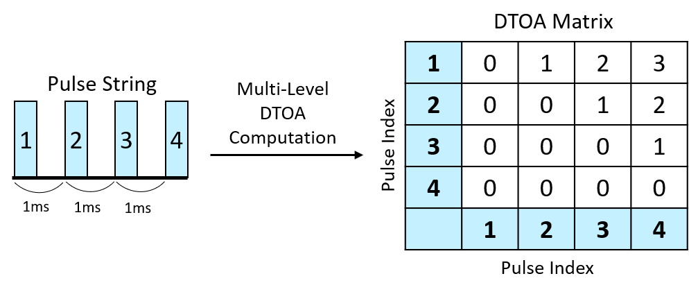
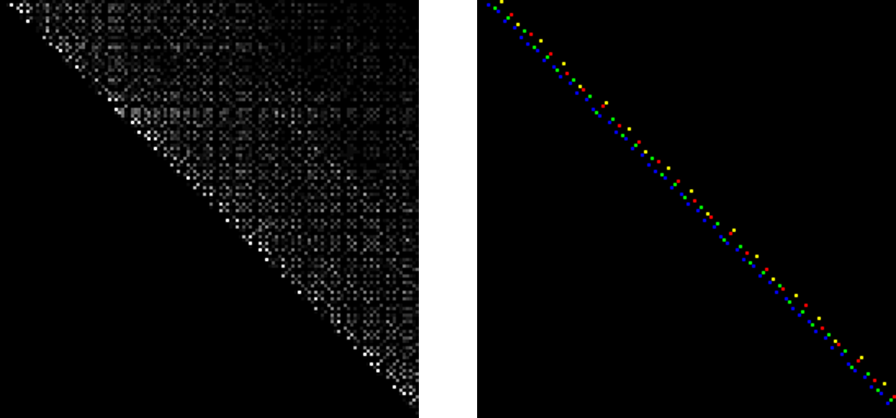

# PRI Frequency Image Dataset

The PRI frequency features of the radar pulse sequence could be represented by an image and we achieve pixel classification by a semantic segmentation network. The paper has been prepared to submit.
We're sharing them here for developers and researchers to explore, study, and learn from.

#### Novelty  


The preprocessing of the "PRI Frequency Image" involves several steps to prepare the data for further analysis:

TOA Difference Matrix Construction: This step calculates multi-order differences of Time of Arrival (TOA), creating an upper triangular matrix that represents the differences between pulses.

PRI Frequency Matrix Conversion: Frequencies of occurrences in the TOA Difference Matrix are calculated and then mapped to a brightness scale of 0 to 255. This process transforms the frequency data into a grayscale image where the brightness level indicates the frequency of specific TOA differences.

PRI Label Matrix Construction: Different modulation types of PRI signals at each position in the matrix are classified using a variety of colors. This enables a visual distinction of various PRI modulations within the image based on color coding.



Given received signal strength (RSS) measurements of the commodity WiFi receiver at the UAV, UH-Sense can detect and localize moving human targets in the monitored area.
- A combination of neural network-based classifier and radio tomography imaging technique (RTI) is utilized to determine the presence of targets and their relative positions, respectively.

#### Dataset type
The data set format is VOC and the content is as follows:

VOC Dataset Structure

```javascript
├── VOCdevkit
│   ├── VOC2012
│   │   ├── ImageSets
│   │   │   ├── Segmentation
│   │   │   │   ├── train.txt
│   │   │   │   ├── val.txt
│   │   │   │   ├── trainval.txt
│   │   ├── JPEGImages
│   │   │   ├── *.jpg    # All images
│   │   ├── SegmentationClass
│   │   │   ├── *.png    # All label images
```

Among them, train.txt, val.txt, trainval.txt only need the picture name, no suffix or path is required.

## Authors & Contributors
PRI Frequency Image Dataset is authored by
[WeiYi Wang],
[YuJia Chen],
from National Central University.
The code is developed by
[WeiYi Wang].
Currently, it is being maintained by
[WeiYi Wang].
